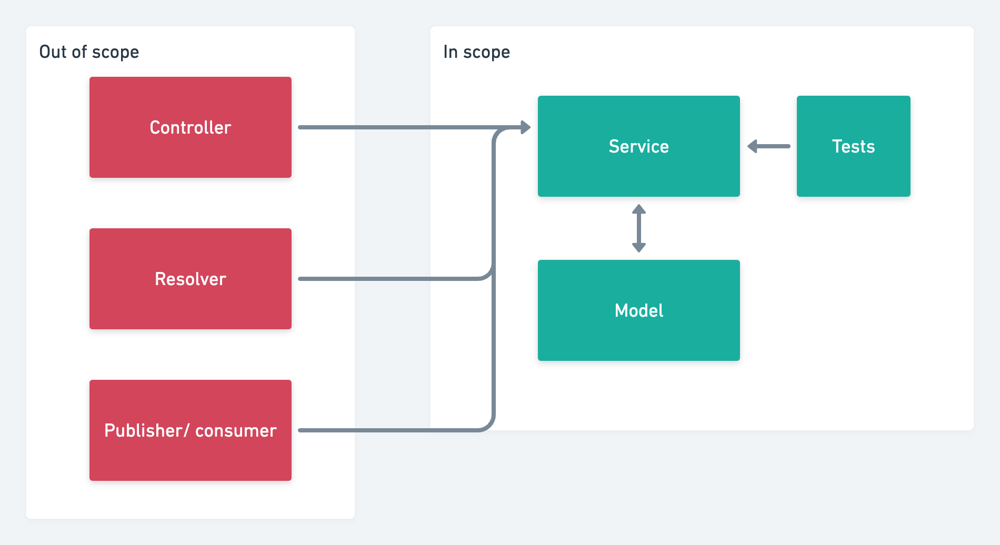

# The ultimate guide to TypeScript with Mongoose

## What does this video cover?
* Typing custom properties on Mongoose models
* Typing virtual methods on Mongoose models
* Typing methods on Mongoose models
* Typing Mongoose operations at the service layer
* Testing service with Jest

## What does this video not cover?
* Anything above the service layer
* How to use Mongooses
* Creating a Mongoose model

## Who is this video for?
* Those already familiar with Mongoose & TypeScript
* Those converting a project to TypeScript
* Those looking to get more out of their existing Mongoose & TypeScript integration

## Let's keep in touch
- [Subscribe on YouTube](https://www.youtube.com/TomDoesTech)
- [Discord](https://discord.gg/4ae2Esm6P7)
- [Twitter](https://twitter.com/tomdoes_tech)
- [TikTok](https://www.tiktok.com/@tomdoestech)
- [Facebook](https://www.facebook.com/tomdoestech)
- [Instagram](https://www.instagram.com/tomdoestech)

[Buy me a Coffee](https://www.buymeacoffee.com/tomn)

[Sign up to DigitalOcean 💖](https://m.do.co/c/1b74cb8c56f4)

